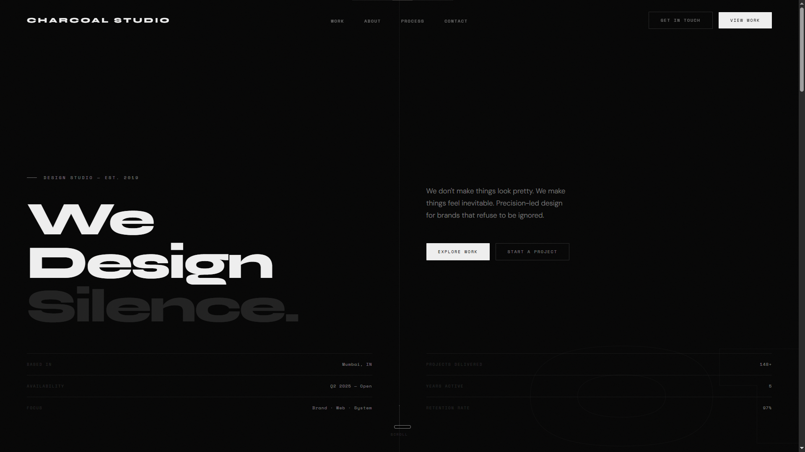
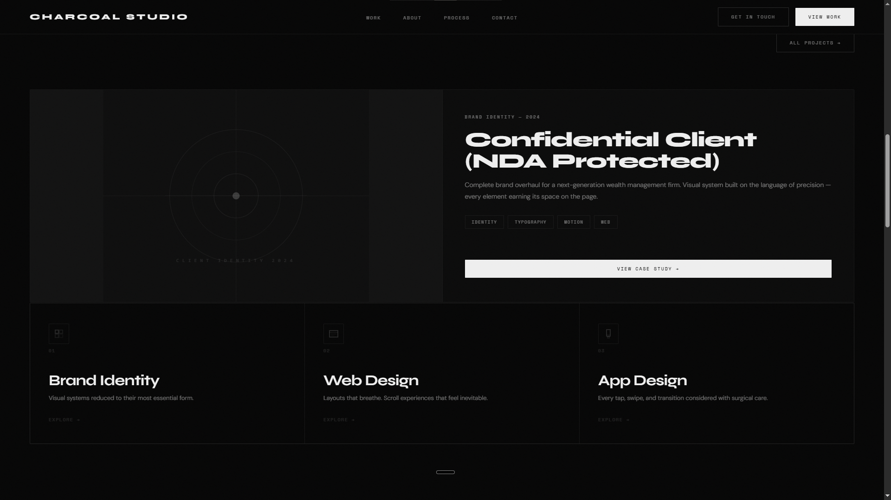
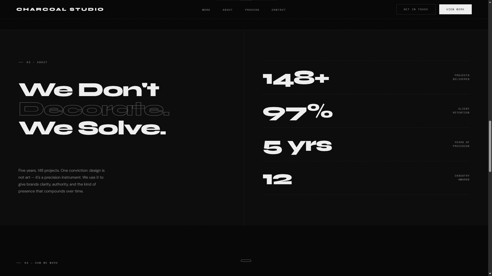
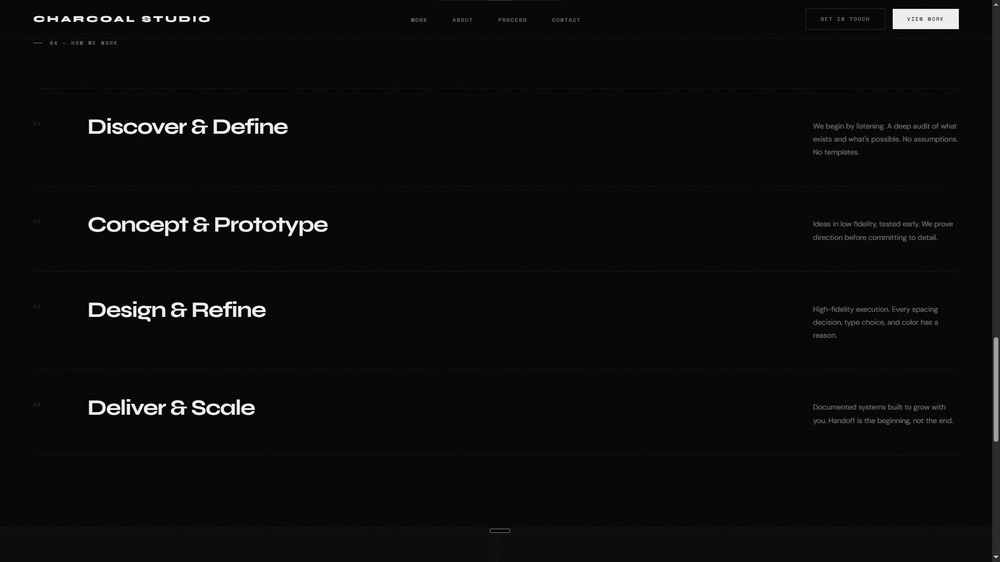
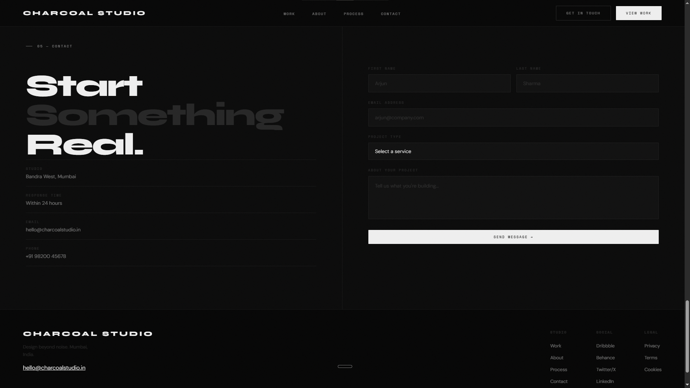

# CHARCOAL STUDIO — Design Studio

A dark, editorial-style landing page for a design studio. One-page, no fluff, no stock photos.

**Live:** https://charcoal-studio.akshaycodecrafter.workers.dev/

## Preview


*The hero section displays "We Design Silence." as its main headline, alongside a tagline about precision-led design, a scroll cue at the bottom, and meta rows for location (Mumbai, IN), availability (Q2 2025 — Open), and three project stats.*


*The work section features a confidential client project (NDA protected, Brand Identity — 2024) as the highlighted case study above a three-card grid of Brand Identity, Web Design, and App Design, each with a minimal inline SVG icon.*


*The about section headlines "We Don't Decorate. We Solve." with a body paragraph about design as a precision instrument, plus four animated counters: 148+ projects delivered, 97% client retention, 5 years of precision, and 12 industry awards.*


*The process section lays out four numbered steps — Discover & Define, Concept & Prototype, Design & Refine, Deliver & Scale — each with a short description and a hover-triggered left border animation.*


*The contact section headlines "Start Something Real." with a split layout: a form on the right collecting First Name, Last Name, Email Address, Project Type, and project details, and on the left the studio location, response time, email, and phone number.*

## About

I built this as a demo for a design-studio-style client. The brief in my head was simple: no stock photography, no generic "we do design" copy, let typography and whitespace carry the page instead of imagery.

## What's on the page

- **Hero** — Large display type (Syne) with a rotating tagline and a scroll cue
- **Work grid** — One featured case study card plus a 3-up grid of smaller project cards, each with a minimal inline SVG icon instead of a photo
- **Process** — Numbered steps walking through how a project moves from brief to delivery
- **Contact** — A working-styled inquiry form plus studio details (location, email, phone, response time)

## Built with


- Vanilla HTML/CSS/JS. No framework, no build step.
- `IntersectionObserver` for scroll-reveal animations. Skipped GSAP on purpose to keep it dependency-free.
- CSS custom properties for the whole color/spacing system, so re-theming for a different client is mostly a variable swap.

## Why I built it this way

I dropped the custom cursor and kept a plain system pointer. On a real client site it usually fights with usability more than it adds polish, and it breaks on trackpads and touch devices anyway. The magnetic hover on the primary buttons stayed, it's subtle enough that it doesn't get in the way.

Everything ships as index.html + css/style.css + js/script.js on purpose. No npm install, no build tooling. Less to break, and easier for whoever inherits this later.

## Running it locally

```
charcoal-studio/
├── index.html
├── css/
│ └── style.css
├── js/
│ └── script.js
└── assets/
    └── favicon.svg
```
Clone it, open index.html in a browser. That's it.

## Status

Demo/concept build. Contact details (email, phone) are illustrative placeholders, not a real studio's information.
